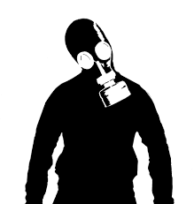

# Urbex ATX
<!-- PROJECT LOGO -->

  

  <h3 align="center">Urbex ATX</h3>

  

    Urban Exploration Map of Austin, TX.
     
     
    <a href="https://github.com/mrauer/urbex-atx/issues">Report Bug</a>
    ·
    <a href="https://github.com/mrauer/urbex-atx/issues">Request Feature</a>
  

<!-- TABLE OF CONTENTS -->

<h2 style="display: inline-block">Table of Contents</h2>

  <ol>
    <li><a href="#about-the-project">About The Project</a></li>
    <li><a href="#what-is-urban-exploration">What is Urban Exploration?</a></li>
    <li><a href="#contribute">Contribute</a></li>
  </ol>

<!-- ABOUT THE PROJECT -->
## About The Project

The objective of this project is to create an exhaustive map of hidden gems in the Austin area from ruins, to accessible roofs, tunnels, caves, etc ... in the Austin, TX area. The technologies used for this project have been kept simple for an easy maintenance.

We're live at: [http://www.urbex-atx.link/](http://www.urbex-atx.link/) !

<!--WHAT IS URBAN EXPLORATION -->
## What is Urban Exploration?

The Wikipedia definition said it all: Urban exploration (often shortened as UE, urbex and sometimes known as roof-and-tunnel hacking) is the exploration of manmade structures, usually abandoned ruins or hidden components of the manmade environment.

<!-- CONTRIBUTE -->
## Contribute

Please feel free to suggest of submit your findings to others. Add a location by clicking on the [issues](https://github.com/mrauer/urbex-atx/issues) section or contact the author. Important note: we don't use addresses but rather exact GPS position.

<!-- LICENSE -->
## License

Distributed under the MIT License. See `LICENSE` for more information.
